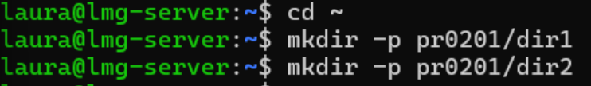
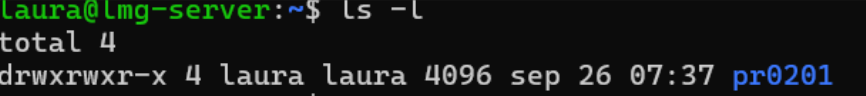
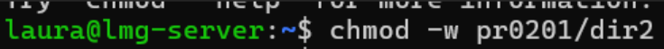
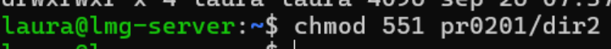
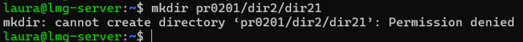
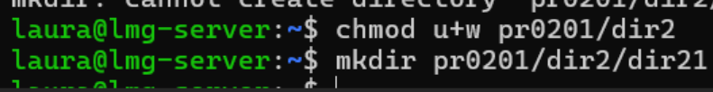

# PR0201: Usuarios y permisos en Linux
## 1. Permisos de usuarios
### 1.	Crea el directorio `pr0201` dentro de tu directorio personal y dentro de él crea los directorios `dir1` y `dir2` ¿Cuáles son los permisos del directorio `dir1`? No pongas una captura, explica quiénes tienen permisos sobre el directorio y qué pueden hacer en él.
  
**usuario->** lectura, escritura, ejecución  
**grupo->** lectura, escritura y ejecución  
**otros->** lectura y ejecución


### 2.	Utilizando   la   notación   simbólica, elimina   todos   los   permisos de   escritura (propietario, grupo, otros) del directorio `dir2`.


### 3.	Utilizando la notación octal, elimina el permiso de lectura del directorio `dir2`, al resto de los usuarios.


### 4.¿Cuáles son ahora los permisos asociados a `dir2`?

`r-xr-x--x`  

usuario-> lectura y ejecución  

grupo-> lectura y ejecución  

otros-> ejecución  

### 5.	Crear bajo `dir2`, un directorio llamado `dir21`.



Falla porque le hemos quitado el permiso de escritura 
### 6.	Concédete a ti mismo permiso de escritura en el directorio `dir2` e intenta de nuevo el paso anterior.

Al proporcionarle al dir2 permiso de escritura ya nos permite crear el dir21 dentro de dir2 
## 2. Notación Octal y simbólica
### 1. Supón que el fichero ~/file tiene los permisos rw-r--r--. Escribe el comando o comandos que necesitarías para establecer los siguientes permisos en el fichero anterior utilizando notación simbólica.

 
1. rwxrwxr-x (usuario y grupo rwx, otros r-x) 

    `chmod u=rwx,g=rwx,o=rx ~/file`
 
2. rwxr--r-- (usuario rwx, grupo r, otros r)

    `chmod u=rwx,g=r,o=r ~/file`

3. r--r----- (usuario r, grupo r, otros nada) 

    `chmod u=r,g=r,o= ~/file`
 
4. rwxr-xr-x (usuario rwx, grupo r-x, otros r-x) 

    `hmod u=rwx,g=rx,o=rx ~/file `
 
5. rwxr-xr-x (repetido, mismo que anterior) 

    `chmod u=rwx,g=rx,o=rx ~/file`

6. r-x--x--x (usuario r-x, grupo --x, otros --x) 

    `chmod u=rx,g=x,o=x ~/file`
 
7. -w-r----x (usuario -w-, grupo r--, otros --x) 

    `chmod u=w,g=r,o=x ~/file `

8. -----xrwx (usuario nada, grupo --x, otros rwx) 

    `chmod u=,g=x,o=rwx ~/file `
 
9. r---w---x (usuario r--, grupo -w-, otros --x) 

    `chmod u=r,g=w,o=x ~/file `
 
10. -w------- (usuario -w-, grupo nada, otros nada) 

    `chmod u=w,g=,o= ~/file `
 
11. rw-r----- (usuario rw-, grupo r--, otros nada) 

    `chmod u=rw,g=r,o= ~/file`
 
12. rwx--x--x (usuario rwx, grupo --x, otros --x) 

    `chmod u=rwx,g=x,o=x ~/file `
# 3 El bit setgid

## 3.1 
```bash
vagrant@ubuntu2204:~$ sudo groupadd asir
vagrant@ubuntu2204:~$ sudo useradd  -G asir rmg1
vagrant@ubuntu2204:~$ sudo useradd  -G asir rmg2
```
## 3.2
```bash
sudo mkdir /compartido
sudo chown root:asir /compartido
```
## 3.3
```bash
sudo chmod 770 /compratido
```
## 3.4
```bash
sudo chmod g+s /compartido
ls -ld /compartido
```
## 3.5
```bash
vagrant@ubuntu2204:~$ su rmg1
Password: 
$ cd /compartido
$ touch fichero1    
$ echo "esto contiene el fichero1" > fichero1
$ ls -l /compartido/fichero1
-rw-rw-r-- 1 rmg1 asir 26 Oct  7 10:19 /compartido/fichero1
```
## 3.6
```bash
$ cat fichero1
esto contiene el fichero1
$ su rmg2
Password:
$ cd /compartido
$ echo "esto lo añadio el 2" >fichero1
$ cat fichero1
esto lo añadio el 2
```
## 3.7
### 3.7.1
El bit setgid asegura que cualquier archivo o subdirectorio creado dentro de un directorio here el grupo propietario del directorio, en lugar del grupo predeterminado del usuario que crea el archivo. Esto es útil en entornos colaborativos porque garantiza que todos los archivos creados dentro de un directorio compartido pertenezcan al grupo del directorio, facilitando la colaboración sin que sea necesario modificar los permisos o grupos manualmente cada vez que se crea un archivo.
### 3.7.2
Si el bit setgid no está habilitado, los archivos y subdirectorios creados dentro del directorio heredarán el grupo del usuario que los crea. Esto puede causar problemas en entornos colaborativos, ya que otros usuarios del grupo original podrían no tener los permisos necesarios para acceder o modificar esos archivos, lo que podría ralentizar el trabajo en equipo y requerir ajustes manuales en los permisos o los grupos de los archivos.
## 3.8
```bash
vagrant@ubuntu2204:~$ sudo userdel  rmg1
vagrant@ubuntu2204:~$ sudo userdel  rmg2
vagrant@ubuntu2204:~$ sudo rm -r  /compartido
```
# 4 El sticky bit
## 4.1
```bash
sudo mkdir /compartido
sudo chmod 777 /compartido
```
## 4.2
```bash
vagrant@ubuntu2204:~$ sudo useradd -m rmg1
vagrant@ubuntu2204:~$ sudo useradd -m rmg2
vagrant@ubuntu2204:~$ sudo passwd rmg1
vagrant@ubuntu2204:~$ sudo passwd rmg2
```
## 4.3
```bash
vagrant@ubuntu2204:~$ su rmg1
Password: 
$ touch /compartido/fichero1.txt
$ exit
vagrant@ubuntu2204:~$ su rmg2
Password: 
$ rm /compartido/fichero1.txt
rm: remove write-protected regular empty file '/compartido/fichero1.txt'?
```
## 4.4
```bash
vagrant@ubuntu2204:~$ sudo chmod +t /compartido
vagrant@ubuntu2204:~$ ls -ld /compartido
drwxrwxrwt 2 root root 4096 Oct  8 07:55 /compartido
```
## 4.5
```bash
vagrant@ubuntu2204:~$ su rmg1
Password: 
$ touch /compartido/archivo2.txt
$ exit
vagrant@ubuntu2204:~$ su rmg2
Password: 
$ rm /compartido/archivo2.txt
rm: remove write-protected regular empty file '/compartido/archivo2.txt'? y
rm: cannot remove '/compartido/archivo2.txt': Operation not permitted
```
## 4.6
### 4.6.1
El sticky bit en un directorio restringe la eliminación o renombramiento de archivos dentro de ese directorio. Específicamente, solo el propietario del archivo (o el usuario root) puede eliminar o renombrar archivos en un directorio con sticky bit, incluso si otros usuarios tienen permisos de escritura en ese directorio.
### 4.6.2
El propietario del fichero.
O tener privilegios de superusuario (root).

[Volver](../../index.md)
