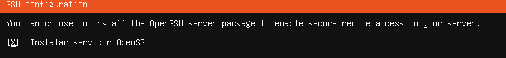
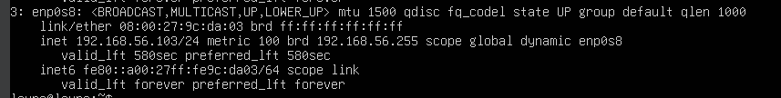

# PR0202: Conexión remota con SSH
## 1. Preparación de la máquina y configuración de la red
### 1.Desde la interfaz de VirtualBox añade un segundo adaptador de red en modo red solo anfitrión.
Colocaremos el adaptador de nuestra maquina en adaptador sólo anfitrión


Durante la instaalción del servidor marcaremos la casilla de **Install OpenSSH server**


### 2. Indica la dirección IP que asigna VirtualBox a este adaptador de red, así como la dirección IP del adaptador correspondiente en la máquina anfitrión.
Ejecutamos el siguiente comando para ver la ip
```bash
  ip a
```


Comprobaremos la ip de la maquina


    
### 3. Comprueba que hay conectividad entre el anfitrión y la máquina virtual.
Comprobaremos la conectividad realizando un ping
```bash
  ping 192.168.56.1
```


Nos conectaremos por ssh desde el windows
```bash
  ssh laura@192.168.56.1
```

### 4. Cambia el hostname de Ubuntu para que se llame {iniciales}_server.
Cambiaremos el hostname del servidor a lmg_server

Realizaremos la comprobación con el siguiente  comando


### 5. Realiza los cambios necesarios en tu equipo Windows para que te resuelva localmente el nombre del servidor Ubuntu.
Tenemos que seguir la siguiente ruta
```bash
  C:\Windows\System32\drivers\etc
```
Una vez ahi entramos en "host" y añadimos una linea con la ip del servidor y el nombre
```bash
  192.168.56.103
```

## 2 Creación del usuario y conexión SSH
### 1. Crea en Ubuntu un usuario que se llamará {iniciales}_ssh, donde iniciales son las de tu nombre y apellidos.
Una vez guardado el fichero anterior añadiremos el usuario

### 2. Realiza los pasos necesarios para que este usurio se pueda conectar mediante SSH mediante contraseña.
Nos volvemos a conectar mediante ssh para verificar que ahora nos pide la contraseña que hemos creado anteriormente


### 3. Una vez que hayas verificado que la conexión funciona haz los cambios necesarios para que la conexión se realize mediante un par de claves pública-privada de forma transparente para el usuario.
Entraremos a PowerShell de nuestra máquina anfitriona y creamos claves mediante el siguiente comando:
```bash
  ssh-keygen
```


Ahora copiamos la clave publica del xubuntu y la añadimos mediante windows powershell
```bash
scp C:\Users\Alumno\.ssh\id_ed25519 lmg_ssh@192.168.56.101:/home/lmg_ssh/
```


Entramos al usuario meidante:
```bash
sudo su - lmg_ssh
```


Copiamos el siguiente fichero para que nos autorice a iniciar sin la contraseña
```bash
cat ~/id_ed25519.pub >> ~/.ssh/authorized_keys
```


Ahora al entrar a nuestro usuario de ubuntu mediante ssh ya no pide contraseña

## 3  Conexión transparente a Github
### Enunciado: Ahora que ya estás cómodo con la autenticación mediante par de claves pública-privada, intenta configurar tu Github para que te puedas conectar sin necesidad de introducir tu contraseña. Como pista, tienes que acceder a tu perfil -> Settings -> SSH and GPG keys

Tenemos que encontrar nuestra clave en la maquina de linux


Añadiremos una nueva clave SSH


Ya podemos ver la clave creada


