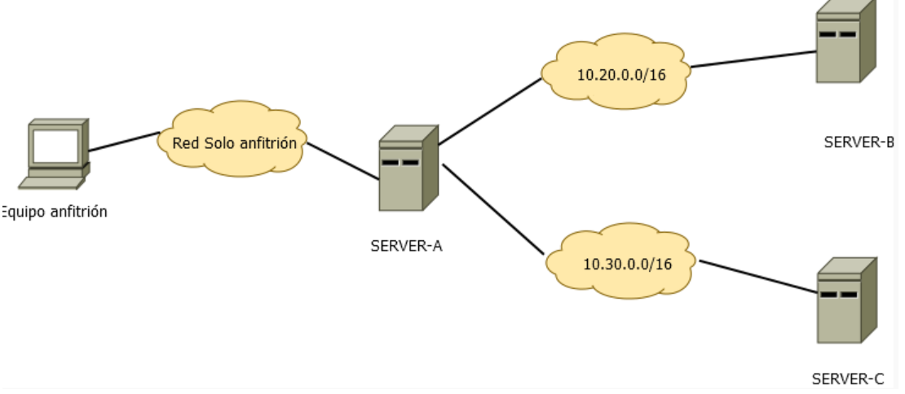
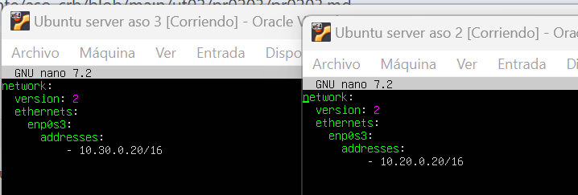
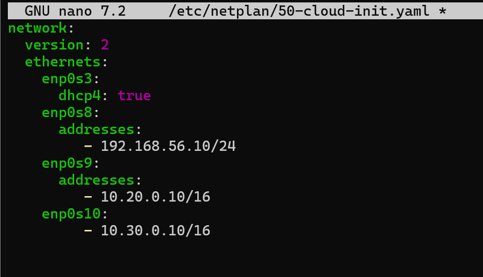
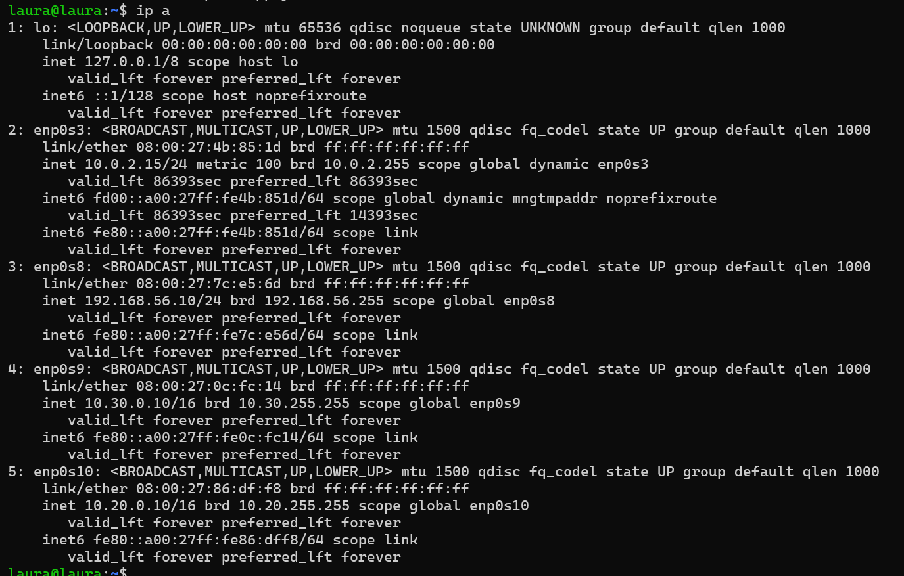
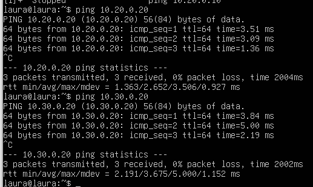

# PR0203: Conexión remota con SSH entre redes
## Entorno de trabajo
### En esta práctica tienes que preparar un entorno con las siguientes características:

- Necesitas 3 máquinas virtuales cuyo nombres de equipo serán: SERVER-A, SERVER-B y SERVER-C
- Tendrás una red solo-anfitrión que se conectará a SERVER-A
- También necesitarás dos redes internas: 10.20.0.0/16 y 10.30.0.0/16
- Las máquinas SERVER-A y SERVER-B estarán conectadas a la primera red, mientras que SERVER-B (que tendrá 2 adaptadores de red) y SERVER-C estarán conectadas a la segunda red.
- El equipo SERVER-A tendrá un usuario con tu nombre
- Los equipos SERVER-B y SERVER-C tendrán un usuario llamado sysadmin.



Utilizaremos el siguiente comando para configurar 

```bash
sudo nano /etc/netplan/50-cloud-init.yaml
```

Añadiremos lo siguiente en los extremos B y C



Para la servidor A



Para implantarlo usaremos el siguiente comando

```bash
sudo netplan apply
```

Como resultado final al realizar ip a nos aparecera la configuracion que hemos realizado antes



Probaremos a hacer ping a los extremos desde la maquina central



Crearemos el usuario sysadmin con el comando **sudo adduser sysadmin**

Creamos la clave del anfitrion para añadirsela al server A

```bash
C:\Users\Administrador>ssh-keygen
Generating public/private ed25519 key pair.
Enter file in which to save the key (C:\Users\Administrador/.ssh/id_ed25519):
Enter passphrase (empty for no passphrase):
Enter same passphrase again:
Your identification has been saved in C:\Users\Administrador/.ssh/id_ed25519
Your public key has been saved in C:\Users\Administrador/.ssh/id_ed25519.pub
The key fingerprint is:
SHA256:zsuaZudqlcN06/8/fEqnudBKMrvykptOCZ8jvp2bsuc administrador@Lenovo-ThinkPad
The key's randomart image is:
+--[ED25519 256]--+
|                 |
|                 |
|                 |
|        . .      |
|      .oSo .     |
|       ==o.  .   |
|      ..O+o o + .|
|     .=***.= + *.|
|     +B%E*+oo.*++|
+----[SHA256]-----+
```
```bash
ssh-copy-id laura@192.168.56.10
```

Verificamos que estan las claves creadas
```bash
laura@laura:~$ cd \.ssh
laura@laura:~/.ssh$ ls
authorized_keys  id_ed25519  id_ed25519.pub  known_hosts  known_hosts.old
laura@laura:~/.ssh$  cat id_ed25519.pub
ssh-ed25519 AAAAC3NzaC1lZDI1NTE5AAAAIDZay07g2y1zxtN2klN8h7A3hsO3FY1EbulRvbVp1NUp laura@laura
```
Copiamos la clave que hemos generado en el server A en el server B haremos lo mismo en el C

```bash
laura@laura:~$ ssh-copy-id sysadmina@10.20.0.20
/usr/bin/ssh-copy-id: INFO: Source of key(s) to be installed: "/home/laura/.ssh/id_ed25519.pub"
/usr/bin/ssh-copy-id: INFO: attempting to log in with the new key(s), to filter out any that are already installed
/usr/bin/ssh-copy-id: INFO: 1 key(s) remain to be installed -- if you are prompted now it is to install the new keys
sysadmin@10.20.0.20's password:

Number of key(s) added: 1
```

Ahora ya tenemos conectados el **anfitrion** con el **server A** y el **server A** con el **server B** y con **server C**

Aqui vemos que al conectar anfitrion con server A no nos ha pedido contraseña

```bash
C:\Users\Administrador>ssh laura@192.168.56.10
Welcome to Ubuntu 24.04.3 LTS (GNU/Linux 6.8.0-86-generic x86_64)

 * Documentation:  https://help.ubuntu.com
 * Management:     https://landscape.canonical.com
 * Support:        https://ubuntu.com/pro

 System information as of mié 05 nov 2025 19:38:32 UTC

  System load:             0.22
  Usage of /:              46.3% of 11.21GB
  Memory usage:            5%
  Swap usage:              0%
  Processes:               103
  Users logged in:         1
  IPv4 address for enp0s3: 10.0.2.15
  IPv6 address for enp0s3: fd00::a00:27ff:fe4b:851d

 * Strictly confined Kubernetes makes edge and IoT secure. Learn how MicroK8s
   just raised the bar for easy, resilient and secure K8s cluster deployment.

   https://ubuntu.com/engage/secure-kubernetes-at-the-edge

El mantenimiento de seguridad expandido para Applications está desactivado

Se pueden aplicar 41 actualizaciones de forma inmediata.
Para ver estas actualizaciones adicionales, ejecute: apt list --upgradable

Active ESM Apps para recibir futuras actualizaciones de seguridad adicionales.
Vea https://ubuntu.com/esm o ejecute «sudo pro status»


Last login: Wed Nov  5 19:30:52 2025 from 192.168.56.1
```
Aqui vemos como se conecta **server A** con **server B** sin pedir contraseña

```bash
laura@laura:~$ ssh sysadmin@10.20.0.20
Welcome to Ubuntu 24.04.3 LTS (GNU/Linux 6.8.0-86-generic x86_64)

 * Documentation:  https://help.ubuntu.com
 * Management:     https://landscape.canonical.com
 * Support:        https://ubuntu.com/pro

 System information as of mié 05 nov 2025 13:05:39 UTC

  System load: 0.0                Memory usage: 5%   Processes:       101
  Usage of /:  46.4% of 11.21GB   Swap usage:   0%   Users logged in: 1


El mantenimiento de seguridad expandido para Applications está desactivado

Se pueden aplicar 41 actualizaciones de forma inmediata.
Para ver estas actualizaciones adicionales, ejecute: apt list --upgradable

Active ESM Apps para recibir futuras actualizaciones de seguridad adicionales.
Vea https://ubuntu.com/esm o ejecute «sudo pro status»


Last login: Wed Nov  5 13:02:49 2025 from 10.20.0.10
```

Aqui vemos como se conecta **server A** con **server C** sin pedir contraseña

```bash
laura@laura:~$ ssh sysadmin@10.30.0.20
Welcome to Ubuntu 24.04.3 LTS (GNU/Linux 6.8.0-86-generic x86_64)

 * Documentation:  https://help.ubuntu.com
 * Management:     https://landscape.canonical.com
 * Support:        https://ubuntu.com/pro

 System information as of mié 05 nov 2025 02:17:10 UTC

  System load: 0.1                Memory usage: 6%   Processes:       101
  Usage of /:  46.2% of 11.21GB   Swap usage:   0%   Users logged in: 1


El mantenimiento de seguridad expandido para Applications está desactivado

Se pueden aplicar 41 actualizaciones de forma inmediata.
Para ver estas actualizaciones adicionales, ejecute: apt list --upgradable

Active ESM Apps para recibir futuras actualizaciones de seguridad adicionales.
Vea https://ubuntu.com/esm o ejecute «sudo pro status»


Last login: Wed Nov  5 02:13:18 2025 from 10.30.0.10
```
Con esto ya habriamos finalizado el ejercicio.

### Explica qué contienen y para qué sirven los siguientes ficheros relacionados con SSH:

```bash
~/.ssh/id_rsa y ~/.ssh/id_rsa.pub
```

**~/.ssh/id_rsa** contiene clave privada del usuario se usa para autenticarse en los servidores, nunca debe compartirse.

**~/.ssh/id_rsa.pub** contiene la clave publica y si se puede compartir pàra permitir el acceso a otros servidores sin contraseña.

```bash
~/.ssh/authorized_keys
```

Contiene la lista de claves públicas autorizadas a entrar.

```bash
~/.ssh/known_hosts
```

Guarda la fingerprint de los servidores SSH a los que te has conectado.

```bash
/etc/ssh/sshd_config
```

Guarda la configuración del servidor SSH.

```bash
/var/log/auth.log
```
Registro de intentos de autenticación, es util para detectar accesos no autorizados.

```bash
/etc/hosts.allow y /etc/hosts/deny
```

**/etc/hosts.allow** indica quienes tienen permiso para conectarse a servcios.

**/etc/hosts/deny** indica quienes tienen prohibido conectarse.