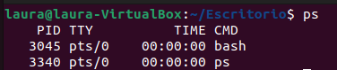

# PR0204: Gestión de procesos en Linux
## 1.Exploración básica de procesos:
- Abre una terminal y utiliza el comando ps para listar los procesos asociados a tu usuario. Anota el PID (Process ID) de al menos tres procesos.
  


- Usa el comando ps aux para listar todos los procesos del sistema. 

Muestra un listado mucho más extenso de los procesos


- Identifica y anota el PID de un proceso que no pertenezca a tu usuario.

Este proceso no esta siendo ejecutado por mi usuario


- Responde a las siguientes preguntas:
    - ¿Qué diferencia hay entre el comando ps y ps aux?

        **ps** sirve para una vista rapida y muestra los procesos del usuario actual.

        **ps aux** sirve para diagnótico y administración general y muestra todos los procesos del sistema con detalles

    - Cuando decimos que un proceso pertenece a un usuario, ¿qué implicaciones tiene? Es decir, ¿en qué afecta eso al proceso?

        Puede afectar en las limitaciones y los permisos que tenga el usuario.
## 2.Monitorización de procesos en tiempo real:
- Utiliza el comando top para monitorizar los procesos en tiempo real. Identifica el proceso que consume más CPU y anota su PID.

El proceso que más cosume es el que aparece el primero, en este caso su pid es 2509


- Cambia la visualización de top para ordenar los procesos por uso de memoria (tecla M). Anota el nombre del proceso que consume más memoria.


- Responde a las siguientes preguntas:
    - ¿Qué columnas de información se muestran en top y cuál es su significado?


        ```bash
        PID-> Process ID
        USUARIO-> user
        PR-> Priority
        NI-> Nice value
        VIRT-> virtual memory
        RES -> Resident memory
        SHR-> Shared memory
        ```

  - Cómo puedes cambiar el intervalo de actualización de top?
   
   Agregamos el parámetro -d y un número

   

## 3.Detener y reanudar procesos:
- Ejecuta el comando sleep 300 & para crear un proceso en segundo plano que duerma durante 300 segundos.


- Usa el comando jobs para listar los trabajos en segundo plano. Anota el ID del trabajo.


- Detén el proceso usando el comando kill con la señal SIGSTOP. Verifica que el proceso esté detenido.


- Reanuda el proceso usando el comando kill con la señal SIGCONT. Verifica que el proceso esté en ejecución nuevamente.
- 


- Responde a las siguientes preguntas:
    - ¿Qué efecto tiene la señal SIGSTOP sobre un proceso?

        El proceso no se termina, solo se suspende su ejecución temporalmente.

    - ¿Cómo puedo verificar si un proceso está detenido o en ejecución?

        Utilizando el comando ps junto con el PID del proceso que queremos verificar.

## 4.Terminar procesos:
- Crea un proceso en segundo plano con el comando sleep 600 &.


- Usa el comando ps para encontrar el PID del proceso sleep.


- Termina el proceso usando el comando kill con la señal SIGTERM. Verifica que el proceso haya sido eliminado.


- Responde a las siguientes preguntas:
    - ¿Qué diferencia hay entre las señales SIGTERM y SIGKILL?

        **SIGTERM** señal habitual que se utiliza para que un proceso se cierre. Permite que el proceso limpie antes de salir.

        **SIGKILL** es una señal forzosa que interrumpe el proceso de inmediato, sin permitirle realizar ninguna acción previa.

    - ¿Por qué es preferible utilizar SIGTERM antes que SIGKILL para terminar un proceso?

        Es mejor utilizar SIGTERM ya que permite que el proceso termine de manera controlada y ordenada.

## 5.Prioridades de procesos:
- Ejecuta el comando nice -n 10 sleep 300 & para crear un proceso con una prioridad baja.
- Usa el comando ps -l para ver la prioridad (NI) del proceso. Anota el valor de NI.
- Cambia la prioridad del proceso usando el comando renice. Establece la prioridad a 5 y verifica el cambio con ps -l.
- Responde a las siguientes preguntas:
    - ¿Para qué sirve el comando nice?
    - ¿Qué rango de valores puede tomar la prioridad (nice value) de un proceso y qué significa cada extremo?
    - ¿Qué ocurre si intentas cambiar la prioridad de un proceso que no te pertenece?
## 6.Procesos en primer y segundo plano:
- Ejecuta el comando sleep 200 en primer plano. Detén el proceso usando Ctrl+Z.
- Usa el comando bg para mover el proceso detenido a segundo plano.
- Trae el proceso de segundo plano a primer plano usando el comando fg.
- Responde las siguientes preguntas:
    - ¿Qué significa que un proceso está en segundo plano?
    - ¿Qué comando utilizarías para mover un proceso detenido a segundo plano?
    - ¿Cómo puedes traer un proceso de segundo plano a primer plano si tienes múltiples trabajos en segundo plano?
## 7.Uso de pstree y htop:
- Instala la herramienta htop si no está disponible en tu sistema (sudo apt install htop).
- Usa htop para explorar los procesos de manera interactiva. Filtra los procesos por usuario y anota el nombre de un proceso que pertenezca a otro usuario.
- Usa el comando pstree para visualizar los procesos en forma de árbol. Identifica un proceso padre y sus procesos hijos, y anota sus nombres.
- Responde las siguientes preguntas:
    - ¿Qué ventaja tiene utilizar pstree frente a ps para visualizar procesos?
    - ¿Cómo puedes filtrar procesos por usuario en htop?
## 8.Matar procesos de manera forzosa:
- Crea un proceso en segundo plano con sleep 400 &.
- Usa el comando kill -9 para terminar el proceso de manera forzosa. Verifica que el proceso haya sido eliminado.
- Responde las siguientes preguntas:
    - ¿En qué casos sería necesario usar kill -9 en lugar de kill sin opciones?
    - ¿Qué riesgos implica usar SIGKILL para terminar un proceso?