```
---------------- ADMINISTRACIÓN DE SISTEMAS INFORMÁTICOS Y REDES ----------------
---------------------------------------------------------------------------------

Módulo:                     ADMINISTRACIÓN DE SISTEMAS OPERATIVOS
Profesor:                   Víctor J. González
Unidad de Trabajo:          UT04
Práctica:                   PR0401. Administración remota de Windows
Resultados de aprendizaje:  RA4
```

# PR0401:  Administración remota con Powershell


En esta práctica vamos a realizar tareas de administración remota de un servidor en modo Core utilizando Powershell..

## 1.- Entorno virtualizado

Necesitarás la siguiente configuración de máquinas virtuales:
- **Windows Server 2019 con experiencia de escritorio** 
- **Windows Server 2016 en modo Core**
- **Windows Server 2016 en modo Core**

Todos los equipos tendrán que tener un adaptador en modo solo-anfitrión en la misma red y otro en modo NAT por si necesitaras acceso a Internet.

Colocamos una ip estatica al windows con escritorio

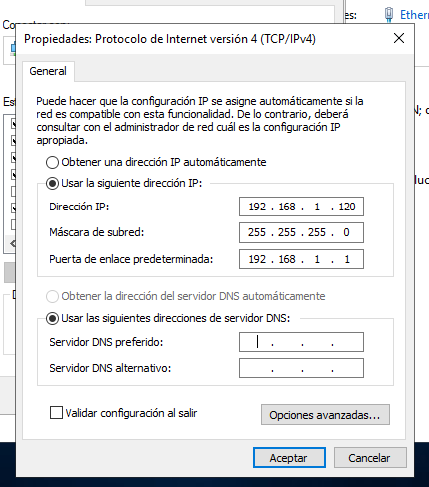

Colocamos la ip del Windows 2019 core


Colocamos la ip del Windows 2016 core


## 2. Preparación de las máquinas

- Comprueba la conectividad entre los tres equipos:
- Asigna **nombres a los equipo**, estos nombres serán:
  - Windows Server 2019 con entorno gráfico: `{INICIALES}-2019`
  - Windows Server 2019 en modo core: `{INICIALES}-CORE-2019`
  - Windows Server 2016 en modo core: `{INICIALES}-CORE-2016`
- Edita el fichero `hosts` de cada equipo para la habilitar la resolución local de nombres entre ellos.

Cmbiamos el nombre al equipo de entorno grafico:

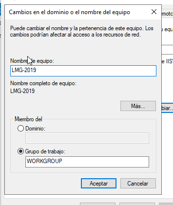

Cambiamos el nombre del 2019 modo core:

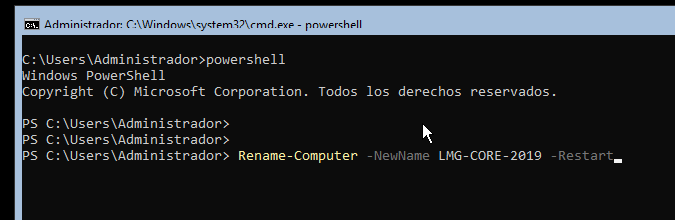

Cambiamos el nombre del 2016 modo core:

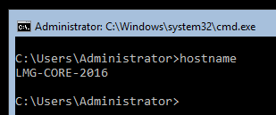

## 3. Configuración del acceso remoto al nuevo equipo

El objetivo es realizar los pasos necesarios para administrar los dos equipos en modo Core desde el equipo con entorno gráfico.

Para comprobar que funciona crea, desde el equipo con entorno gráfico, un usuario con privilegios de administrador llamado `admin_{iniciales}`. Si no sabes cómo hacerlo tienes una breve guía [aquí](https://intelaf.wordpress.com/2022/08/12/como-crear-usuario-administrador-desde-powershell-en-windows-11/)


## 4. Configuración del acceso remoto sobre HTTPS

- Una vez que hayas comprobado que tienes todo bien configurado es el momento de asegurar nuestra red preparándola para que utilice **WinRM sobre HTTPS** utilizando un certificado autofirmado.
- Realiza los pasos necesarios para que la comunicación con ambos servidores utilice este mecanismo.

Desactivamos el firewall de los cores y del entorno grafico


Añadimos las IP de las maquinas en el fichero de hosts

```bash
notepad C:\Windows\System32\drivers\etc\hosts
```

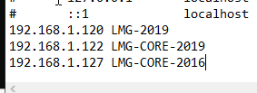

Ejecutamos los siguientes comandos:

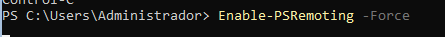

En el 2016 core 

```bash
Set-Item WSMan:\localhost\Client\TrustedHosts -Value "LMG-2019,LMG-CORE-2019" -Force
```
En el 2019 core

```bash
Set-Item WSMan:\localhost\Client\TrustedHosts -Value "LMG-2019,LMG-CORE-2016 -Force
```
En el 2019 con interfaz grafico

```bash
Set-Item WSMan:\localhost\Client\TrustedHosts -Value "LMG-CORE-2016,LMG-CORE-2019" -Force
```


Vamos a crear usuarios


Ahora vamos a asegurar nuestra red

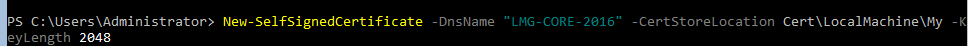

Vamos a borrar el Listener

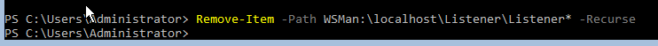

Creamos el nuevo listener con el hash del certificado que hemos creado

```bash
PS C:\Users\vboxuser> New-Item -Ptah WSMan:\localhost\Listener -Transport HTTPS -Address * -CertificateThumbPrint 4F9B28A1C0D7E5F3B2A6D9E8C1F0A4B7
```
Comprobamos que el puerto del HTTPS del firewall esta abierto

```bash
PS C:\Users\vboxuser> netsh advfirewall firewall add rule name="WinRM HTTPS" protocol=TCP dir=in localport=5986 action=allow
Ok.
```
Antes de conectarnos desde el entorno grafico debemos importar el certificado

```
PS C:\Users\vboxuser> Export-Certificate `
>> -Cert Cert:\LocalMachine\My\4F9B28A1C0D7E5F3B2A6D9E8C1F0A4B7 `
>> -FilePath C:\servercert.cer


    Directory: C:\


Mode                LastWriteTime         Length Name
----                -------------         ------ ----
-a----        1/28/2026   5:52 PM            808 servercert.cer
```

Ahora vamos a crear una carpeta compartida en el windows grafico a la que llamaremos "compartir".Realizaremos los siguientes pasos

- Crear la carpeta en la raiz de C:
- Compartir la carpeta con el alias "compartir" la vincularemos con la ruta de la red
- Le damos todos los permisos
- Aseguramos que puedan acceder

Ahora en el core:

```
PS C:\Users\vboxuser> net use \\192.168.1.120\compartir /user:Administrador
Enter the password for 'Administrador' to connect to '192.168.1.120':
The command completed successfully.

PS C:\Users\vboxuser> Copy-Item `
>> -Path C:\servercert.cer `
>> -Destination "\\192.168.1.120\compartir"

```
En el entorno grafico si nos colocamos en la carpeta compartir podremos importar el certificado del core

```
PS C:\compartida> Import-Certificate `
>> -FilePath C:\compartir\servercert.cer `
>> -CertStoreLocation Cert:\LocalMachine\Root


    PSParentPath: Microsoft.PowerShell.Security\Certificate::LocalMachine\Root

Thumbprint                                Subject
----------                                -------
 4F9B28A1C0D7E5F3B2A6D9E8C1F0A4B7     CN=192.168.1.120

```


Ahora tendriamos que repetir el mismo proceso para el otro core
## 5. Configuración remota con Windows Admin Center

- Por último, configura tus equipos para poder administrarlos de forma remota utilizando **Windows Admin Center** desde el equipo con entorno gráfico.

Desactivamso la "Configuración de seguridad mejorada de IE"


Realizamos la instalación de Windows Admin Center

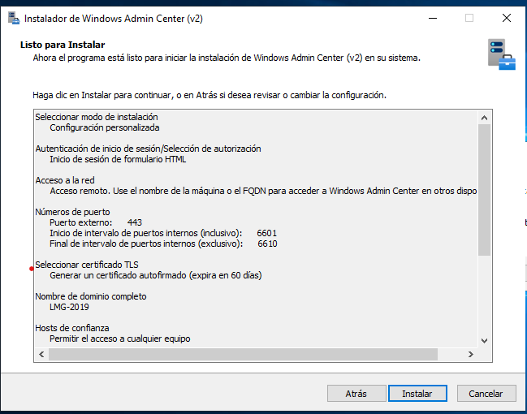

Nos aparecera que el sitio no es seguro tendremos queponerle que confiamos en nuestro certificado autofirmado

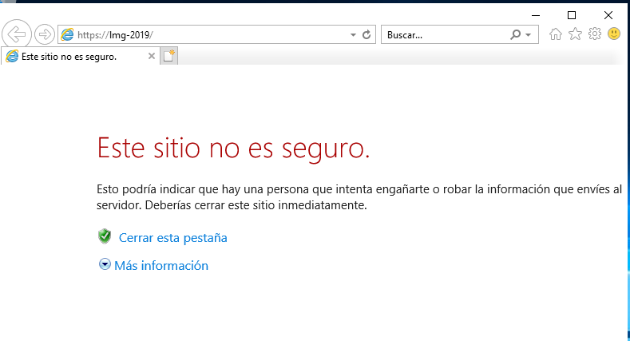

Rellenamos las credenciales

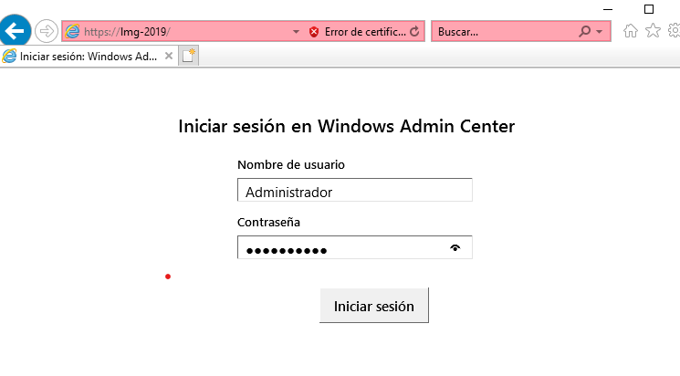

En este paso dejo de funcionar la maquina y se estropeo
## 6. Documentación

Como es habitual, tienes que documentar los pasos más relevantes que has seguido para realizar la práctica.