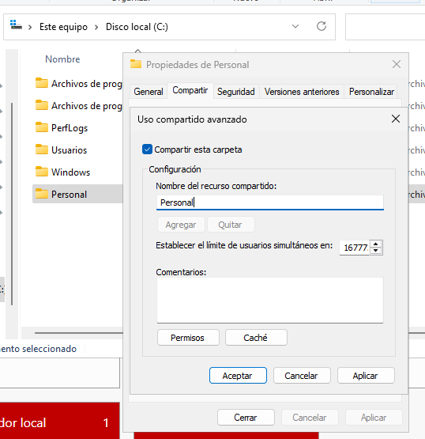
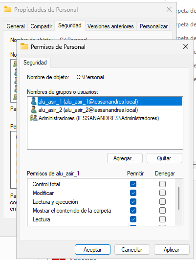
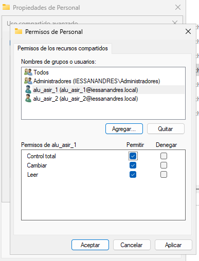
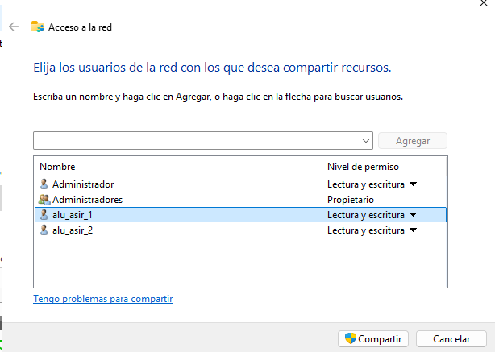
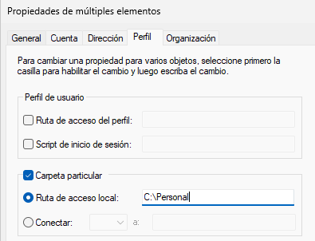
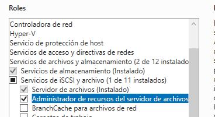
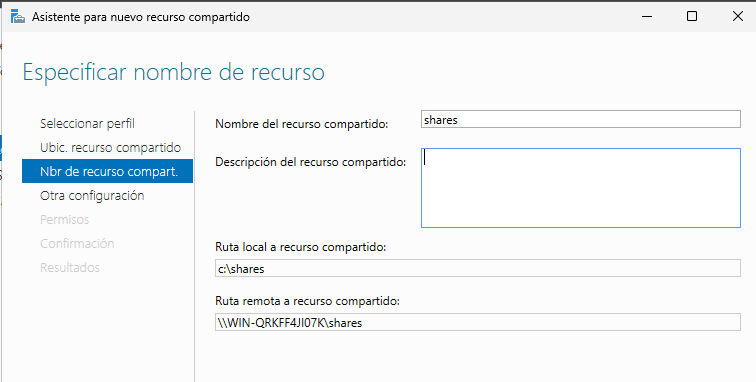
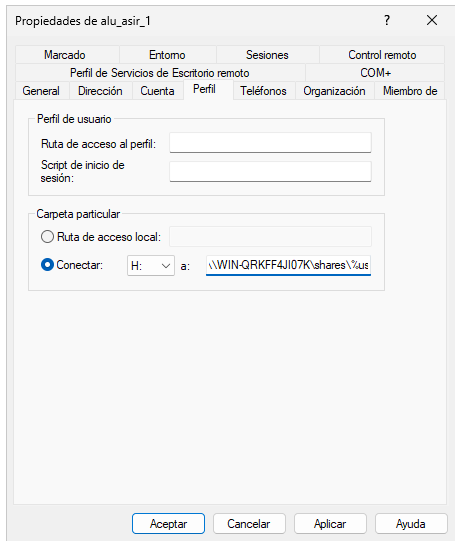

```
---------------- ADMINISTRACIÓN DE SISTEMAS INFORMÁTICOS Y REDES ----------------
---------------------------------------------------------------------------------

Módulo:                     ADMINISTRACIÓN DE SISTEMAS OPERATIVOS
Profesor:                   Víctor J. González
Unidad de Trabajo:          UT05
Práctica:                   PR0502. Carpetas personales y compartidas por grupo
Resultados de aprendizaje:  RA1
```


# PR0502: Carpetas personales y compartidas por un grupo

Realiza los siguiente pasos en tu dominio:

## Creación de usuarios y grupos

- Siguiendo la práctica del otro día, crea una carpeta personal para todos los alumnos de ASIR.



La ruta de acceso de red es:

**\\WIN-QRKFF4JI07K\Personal**

Le damos permisos de lectura y escritura a alu_asir_1 y alu_asir_2




Le comparto la carpeta con alu_asir_1 y alu_asir_2



Configuramos las cuentas de cada usuario para que almacenen la informacion en la carpeta creada anteriormente




## Carpetas personales

- Instala el *Administrador de recursos del servidor de archivos* que está dentro del rol *Servicios de archivos y almacenamiento*
- Utilizando la herramienta *Servicios de archivos y de almacenamiento* del *Administrador del servidor*, crea una carpeta para cada usuario dentro de `C:\shares` y realiza los pasos necesarios para que ambos usuarios puedan ver esta carpeta como una unidad de red identificada con la letra `H:`
- Comprueba que la carpeta de cada usuario solo pueda ser accedida por él mismo.

Agregamos los roles **Servicio de archivos** y **Administrador de recursos del servidor de archivos**



Creamos el recurso compartido



Cpolocamos la ruta remota para crear una carpeta personal

  

Ahora ya se genera una carpeta para cada usuario

[](imagenes/0502.10.png)

## Carpetas compartidas por un grupo

- Crea en `C:\shares` una carpeta llamada `apuntes` y realiza las tareas necesarias para que los alumnos de ASIR puedan acceder a ella como un espacio de almacenamiento compartido con permiso de lectura.
- Luego crea otra llamada `práctica` en la que tengan permiso de lectura y escritura

Creamos la carpeta apuntes, deshabilitamos la herencia y crearemos el grupo GRP_Alumnos_ASIR, solo le daremos permiso de lectura.

[](imagenes/0502.11.png)

[](imagenes/0502.14.png)

Creamos la carpeta practica a la cual le damos permiso de lectura y escritura

[](imagenes/0502.12.png)

[](imagenes/0502.13.png)

