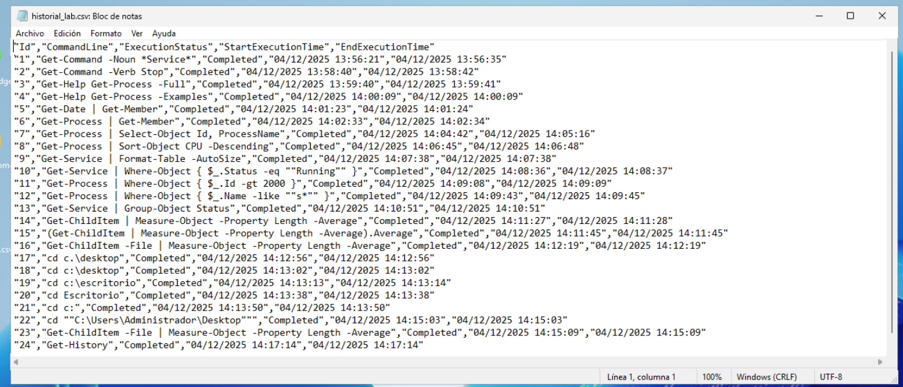

```
---------------- ADMINISTRACIÓN DE SISTEMAS INFORMÁTICOS Y REDES ----------------
---------------------------------------------------------------------------------

Módulo:                     ADMINISTRACIÓN DE SISTEMAS OPERATIVOS
Profesor:                   Víctor J. González
Unidad de Trabajo:          UT06
Práctica:                   PR0601. Introducción a PowerShell
Resultados de aprendizaje:  RA
```

# PR0601:  Introducción a Powershell

## Objetivo

El objetivo de esta práctica será demostrar destreza en la búsqueda de comandos, comprensión de objetos y uso avanzado del pipeline para filtrar y formatear datos.


### Bloque 1: Descubrimiento y ayuda


1.  **Búsqueda por nombre (Sustantivo):** lista todos los comandos disponibles en el sistema que tengan la palabra `Service` en su nombre (noun) para identificar qué herramientas tienes para gestionar servicios.
2.  **Búsqueda por acción (Verbo):** lista todos los comandos disponibles cuya acción sea `Stop` (detener), independientemente de lo que detengan.
3.  **Uso de la ayuda:** muestra por pantalla la ayuda detallada del comando `Get-Process`, pero asegúrate de que se muestren específicamente los **ejemplos** de uso.


```bash
1- Get-Command -Noun *Service*

PS C:\Users\Administrador> Get-Command -Noun *Service*

CommandType     Name                                               Version    Source
-----------     ----                                               -------    ------
Function        Get-NetFirewallServiceFilter                       2.0.0.0    NetSecurity
Function        Get-SMServerService                                1.0.0.0    ServerManagerTasks
Function        Set-NetFirewallServiceFilter                       2.0.0.0    NetSecurity
Cmdlet          Add-ADComputerServiceAccount                       1.0.1.0    ActiveDirectory
Cmdlet          Complete-ADServiceAccountMigration                 1.0.1.0    ActiveDirectory
Cmdlet          Get-ADComputerServiceAccount                       1.0.1.0    ActiveDirectory
Cmdlet          Get-ADServiceAccount                               1.0.1.0    ActiveDirectory
Cmdlet          Get-Service                                        3.1.0.0    Microsoft.PowerShell.Management
Cmdlet          Install-ADServiceAccount                           1.0.1.0    ActiveDirectory
Cmdlet          New-ADServiceAccount                               1.0.1.0    ActiveDirectory
Cmdlet          New-Service                                        3.1.0.0    Microsoft.PowerShell.Management
Cmdlet          New-WebServiceProxy                                3.1.0.0    Microsoft.PowerShell.Management
Cmdlet          Remove-ADComputerServiceAccount                    1.0.1.0    ActiveDirectory
Cmdlet          Remove-ADServiceAccount                            1.0.1.0    ActiveDirectory
Cmdlet          Reset-ADServiceAccountMigration                    1.0.1.0    ActiveDirectory
Cmdlet          Reset-ADServiceAccountPassword                     1.0.1.0    ActiveDirectory
Cmdlet          Restart-Service                                    3.1.0.0    Microsoft.PowerShell.Management
Cmdlet          Resume-Service                                     3.1.0.0    Microsoft.PowerShell.Management
Cmdlet          Set-ADServiceAccount                               1.0.1.0    ActiveDirectory
Cmdlet          Set-Service                                        3.1.0.0    Microsoft.PowerShell.Management
Cmdlet          Start-ADServiceAccountMigration                    1.0.1.0    ActiveDirectory
Cmdlet          Start-Service                                      3.1.0.0    Microsoft.PowerShell.Management
Cmdlet          Stop-Service                                       3.1.0.0    Microsoft.PowerShell.Management
Cmdlet          Suspend-Service                                    3.1.0.0    Microsoft.PowerShell.Management
Cmdlet          Test-ADServiceAccount                              1.0.1.0    ActiveDirectory
Cmdlet          Undo-ADServiceAccountMigration                     1.0.1.0    ActiveDirectory
Cmdlet          Uninstall-ADServiceAccount                         1.0.1.0    ActiveDirectory

```

```bash
2- Get-Command -Verb Stop

PS C:\Users\Administrador> Get-Command -Verb Stop

CommandType     Name                                               Version    Source
-----------     ----                                               -------    ------
Function        Stop-DscConfiguration                              1.1        PSDesiredStateConfiguration
Function        Stop-Dtc                                           1.0.0.0    MsDtc
Function        Stop-DtcTransactionsTraceSession                   1.0.0.0    MsDtc
Function        Stop-EtwTraceSession                               1.0.0.0    EventTracingManagement
Function        Stop-FSRMClassification                            2.0.0.0    FileServerResourceManager
Function        Stop-FSRMFileManagementJob                         2.0.0.0    FileServerResourceManager
Function        Stop-FsrmStorageReport                             2.0.0.0    FileServerResourceManager
Function        Stop-NetEventSession                               1.0.0.0    NetEventPacketCapture
Function        Stop-PcsvDevice                                    1.0.0.0    PcsvDevice
Function        Stop-RDVirtualDesktopCollectionJob                 2.0.0.0    RemoteDesktop
Function        Stop-ScheduledTask                                 1.0.0.0    ScheduledTasks
Function        Stop-SilLogging                                    2.0.0.0    SoftwareInventoryLogging
Function        Stop-SMPerformanceCollector                        1.0.0.0    ServerManagerTasks
Function        Stop-StorageDiagnosticLog                          2.0.0.0    Storage
Function        Stop-StorageJob                                    2.0.0.0    Storage
Function        Stop-Trace                                         1.0.0.0    PSDiagnostics
Cmdlet          Stop-AppvClientConnectionGroup                     1.0.0.0    AppvClient
Cmdlet          Stop-AppvClientPackage                             1.0.0.0    AppvClient
Cmdlet          Stop-Computer                                      3.1.0.0    Microsoft.PowerShell.Management
Cmdlet          Stop-DtcDiagnosticResourceManager                  1.0.0.0    MsDtc
Cmdlet          Stop-IscsiVirtualDiskOperation                     2.0.0.0    IscsiTarget
Cmdlet          Stop-Job                                           3.0.0.0    Microsoft.PowerShell.Core
Cmdlet          Stop-Process                                       3.1.0.0    Microsoft.PowerShell.Management
Cmdlet          Stop-ReFSDedupJob                                  2.0.0.0    Microsoft.ReFsDedup.Commands
Cmdlet          Stop-Service                                       3.1.0.0    Microsoft.PowerShell.Management
Cmdlet          Stop-Transcript                                    3.0.0.0    Microsoft.PowerShell.Host

```

```bash
3- Get-Help Get-Process -Examples

PS C:\Users\Administrador> Get-Help Get-Process -Examples

NOMBRE
    Get-Process

ALIAS
    gps
    ps


NOTAS
    Get-Help no encuentra los archivos de Ayuda para este cmdlet en el equipo. Mostrará solo una parte de la Ayuda.
        -- Para descargar e instalar los archivos de Ayuda para el módulo que incluye este cmdlet, use Update-Help.
        -- Para ver en línea el tema de Ayuda de este cmdlet, escriba "Get-Help Get-Process -Online" o
           vaya a https://go.microsoft.com/fwlink/?LinkID=113324.
```
### Bloque 2: Exploración de objetos

4.  **Introspección de tipos:** ejecuta el comando para obtener la fecha actual (`Get-Date`) pero canaliza su salida para ver la lista de sus **Miembros** (Members).
      * Responde: ¿Cuál es el `TypeName` del objeto devuelto?.
5.  **Identificación de Propiedades vs Métodos:** usando el comando `Get-Member` sobre un proceso cualquiera (ej: `Get-Process`), identifica el nombre de un **Método** que permita finalizar (matar) el proceso.

```bash
4- Get-Date | Get-Member


PS C:\Users\Administrador> Get-Date | Get-Member


   TypeName: System.DateTime

Name                 MemberType     Definition
----                 ----------     ----------
Add                  Method         datetime Add(timespan value)
AddDays              Method         datetime AddDays(double value)
AddHours             Method         datetime AddHours(double value)
AddMilliseconds      Method         datetime AddMilliseconds(double value)
AddMinutes           Method         datetime AddMinutes(double value)
AddMonths            Method         datetime AddMonths(int months)
AddSeconds           Method         datetime AddSeconds(double value)
AddTicks             Method         datetime AddTicks(long value)
AddYears             Method         datetime AddYears(int value)
CompareTo            Method         int CompareTo(System.Object value), int CompareTo(datetime value), int IComparabl...
Equals               Method         bool Equals(System.Object value), bool Equals(datetime value), bool IEquatable[da...
GetDateTimeFormats   Method         string[] GetDateTimeFormats(), string[] GetDateTimeFormats(System.IFormatProvider...
GetHashCode          Method         int GetHashCode()
GetObjectData        Method         void ISerializable.GetObjectData(System.Runtime.Serialization.SerializationInfo i...
GetType              Method         type GetType()
GetTypeCode          Method         System.TypeCode GetTypeCode(), System.TypeCode IConvertible.GetTypeCode()
IsDaylightSavingTime Method         bool IsDaylightSavingTime()
Subtract             Method         timespan Subtract(datetime value), datetime Subtract(timespan value)
ToBinary             Method         long ToBinary()
ToBoolean            Method         bool IConvertible.ToBoolean(System.IFormatProvider provider)
ToByte               Method         byte IConvertible.ToByte(System.IFormatProvider provider)
ToChar               Method         char IConvertible.ToChar(System.IFormatProvider provider)
ToDateTime           Method         datetime IConvertible.ToDateTime(System.IFormatProvider provider)
ToDecimal            Method         decimal IConvertible.ToDecimal(System.IFormatProvider provider)
ToDouble             Method         double IConvertible.ToDouble(System.IFormatProvider provider)
ToFileTime           Method         long ToFileTime()
ToFileTimeUtc        Method         long ToFileTimeUtc()
ToInt16              Method         int16 IConvertible.ToInt16(System.IFormatProvider provider)
ToInt32              Method         int IConvertible.ToInt32(System.IFormatProvider provider)
ToInt64              Method         long IConvertible.ToInt64(System.IFormatProvider provider)

```

```bash
5- Get-Process | Get-Member

PS C:\Users\Administrador> Get-Process | Get-Member


   TypeName: System.Diagnostics.Process

Name                       MemberType     Definition
----                       ----------     ----------
Handles                    AliasProperty  Handles = Handlecount
Name                       AliasProperty  Name = ProcessName
NPM                        AliasProperty  NPM = NonpagedSystemMemorySize64
PM                         AliasProperty  PM = PagedMemorySize64
SI                         AliasProperty  SI = SessionId
VM                         AliasProperty  VM = VirtualMemorySize64
WS                         AliasProperty  WS = WorkingSet64
Disposed                   Event          System.EventHandler Disposed(System.Object, System.EventArgs)
ErrorDataReceived          Event          System.Diagnostics.DataReceivedEventHandler ErrorDataReceived(System.Object, System.Diagnostics.DataReceivedEventArgs)
Exited                     Event          System.EventHandler Exited(System.Object, System.EventArgs)
OutputDataReceived         Event          System.Diagnostics.DataReceivedEventHandler OutputDataReceived(System.Object, System.Diagnostics.DataReceivedEventArgs)
BeginErrorReadLine         Method         void BeginErrorReadLine()
BeginOutputReadLine        Method         void BeginOutputReadLine()
CancelErrorRead            Method         void CancelErrorRead()
CancelOutputRead           Method         void CancelOutputRead()
Close                      Method         void Close()
CloseMainWindow            Method         bool CloseMainWindow()
CreateObjRef               Method         System.Runtime.Remoting.ObjRef CreateObjRef(type requestedType)
Dispose                    Method         void Dispose(), void IDisposable.Dispose()
Equals                     Method         bool Equals(System.Object obj)
GetHashCode                Method         int GetHashCode()

``` 
### Bloque 3: El Pipeline (selección y ordenación)


6.  **Selección de columnas:** obtén la lista de todos los procesos, pero muestra por pantalla **únicamente** las propiedades `Id` y `ProcessName`. El resto de información debe ser descartada.
7.  **Ordenación básica:** lista todos los procesos del sistema, ordenados por su consumo de `CPU` de forma **descendente** (el que más consume primero).
8.  **Formato de tabla:** obtén los servicios del sistema y fuerza la salida para que se muestre como una tabla (`Format-Table`) que se auto-ajuste (`-AutoSize`) al ancho de la ventana.

```bash

6- Get-Process | Select-Object Id, ProcessName


PS C:\Users\Administrador> Get-Process | Select-Object Id, ProcessName

  Id ProcessName
  -- -----------
3256 AggregatorHost
 392 AzureArcSysTray
3972 backgroundTaskHost
 508 csrss
 576 csrss
5900 ctfmon
3004 dfsrs
3136 dfssvc
1028 dllhost
3032 dns
 504 dwm
2984 explorer
 916 fontdrvhost
 924 fontdrvhost
   0 Idle
2240 ismserv
 704 lsass
2956 Microsoft.ActiveDirectory.WebServices
2816 mmc
4832 mmc
4380 MoNotificationUx

```

```bash
7- Get-Process | Sort-Object CPU -Descending

PS C:\Users\Administrador> Get-Process | Sort-Object CPU -Descending

Handles  NPM(K)    PM(K)      WS(K)     CPU(s)     Id  SI ProcessName
-------  ------    -----      -----     ------     --  -- -----------
    979      88    38968     105072   1.168,09   5696   0 svchost
    909     228   276376     217700     804,67   2756   0 MsMpEng
   2584       0       40        172     376,38      4   0 System
    956      73    78396     154332     151,53    504   1 dwm
    605      30    36352     105928     135,53    472   1 WindowsTerminal
   3139     125    61868     257244      84,19   2984   1 explorer
   1896     142    54956      67200      45,23    704   0 lsass
    433      14    16008      23492      33,56   1740   0 svchost
    308      16    11552      17136      31,31   4496   0 svchost
    447      16     9236      24116      31,11   3044   0 svchost
    729      56    39908      79436      28,67   2816   1 mmc
    164      10     2292       8232      25,89   1680   0 VBoxService
    456      21    18108      45516      25,86   5044   0 MoUsoCoreWorker
    419      35    16816      28856      20,22   3004   0 dfsrs
    634      42   122316     121080      15,94   5992   1 ServerManager
   1076      21     6076      17572      14,00    988   0 svchost
    673      14     5312      16420      12,77    692   0 services
    408      18     1904       7632      11,91    576   1 csrss
    523      44    12008      40000       8,94   4832   1 mmc
    739      25    18428      54912       8,66   3012   0 svchost
    789      20     4836      21404       7,03   1428   0 svchost
   1511      60    60432     166852       6,91   6336   1 msedge
    470      28    83888     133848       6,84   3724   1 msedge

```

```bash
8- Get-Service | Format-Table -AutoSize

PS C:\Users\Administrador> Get-Service | Format-Table -AutoSize

Status  Name                                      DisplayName
------  ----                                      -----------
Running ADWS                                      Servicios web de Active Directory
Stopped ALG                                       Servicio de puerta de enlace de nivel de aplicación
Stopped AppIDSvc                                  Identidad de aplicación
Running Appinfo                                   Información de la aplicación
Stopped AppMgmt                                   Administración de aplicaciones
Stopped AppReadiness                              Preparación de aplicaciones
Stopped AppVClient                                Microsoft App-V Client
Stopped AppXSvc                                   Servicio de implementación de AppX (AppXSVC)
Running AudioEndpointBuilder                      Compilador de extremo de audio de Windows
Running Audiosrv                                  Audio de Windows
Stopped AxInstSV                                  Instalador de ActiveX (AxInstSV)
Running BFE                                       Motor de filtrado de base
Running BITS                                      Servicio de transferencia inteligente en segundo plano (BITS)
Stopped BluetoothUserService_139970               BluetoothUserService_139970
Running BrokerInfrastructure                      Servicio de infraestructura de tareas en segundo plano
Stopped BTAGService                               BTAGService
Stopped BthAvctpSvc                               BthAvctpSvc
Stopped bthserv                                   Servicio de compatibilidad con Bluetooth
Running camsvc                                    Servicio Administrador de funcionalidad de acceso
Stopped CaptureService_139970                     CaptureService_139970
Running cbdhsvc_139970                            Servicio de usuario del portapapeles_139970
Running CDPSvc                                    Servicio de plataforma de dispositivos conectados
Running CDPUserSvc_139970                         Servicio de usuario de plataforma de dispositivos conectados_139970
Stopped CertPropSvc                               Propagación de certificados
Stopped ClipSVC                                   Servicio de licencia de cliente (ClipSVC)
Stopped CloudBackupRestoreSvc_139970              CloudBackupRestoreSvc_139970
Stopped COMSysApp                                 Aplicación del sistema COM+
Stopped ConsentUxUserSvc_139970                   Servicio de usuario ConsentUX_139970
Running CoreMessagingRegistrar                    CoreMessaging
Stopped CredentialEnrollmentManagerUserSvc_139970 CredentialEnrollmentManagerUserSvc_139970
Running CryptSvc                                  Servicios de cifrado
Stopped CscService                                Archivos sin conexión
Running DcomLaunch                                Iniciador de procesos de servidor DCOM

```

### Bloque 4: Filtrado y lógica (Where-Object)

9.  **Filtrado exacto:** muestra una lista de los servicios cuyo estado (`Status`) sea exactamente igual (`-eq`) a "Running".
10. **Filtrado numérico:** lista los procesos cuyo identificador (`Id`) sea mayor que (`-gt`) 2000.
11. **Filtrado con comodines:** busca y muestra todos los procesos cuyo nombre (`Name`) comience por la letra "s" utilizando el operador `-like` y el comodín adecuado.

```bash
9- Get-Service | Where-Object { $_.Status -eq "Running" }

PS C:\Users\Administrador> Get-Service | Where-Object { $_.Status -eq "Running" }

Status   Name               DisplayName
------   ----               -----------
Running  ADWS               Servicios web de Active Directory
Running  Appinfo            Información de la aplicación
Running  AudioEndpointBu... Compilador de extremo de audio de W...
Running  Audiosrv           Audio de Windows
Running  BFE                Motor de filtrado de base
Running  BITS               Servicio de transferencia inteligen...
Running  BrokerInfrastru... Servicio de infraestructura de tare...
Running  camsvc             Servicio Administrador de funcional...
Running  cbdhsvc_139970     Servicio de usuario del portapapele...
Running  CDPSvc             Servicio de plataforma de dispositi...
Running  CDPUserSvc_139970  Servicio de usuario de plataforma d...
Running  CoreMessagingRe... CoreMessaging
Running  CryptSvc           Servicios de cifrado
Running  DcomLaunch         Iniciador de procesos de servidor DCOM
Running  DeviceInstall      Servicio de instalación de disposit...
Running  Dfs                Espacio de nombres DFS
Running  DFSR               Replicación DFS
Running  Dhcp               Cliente DHCP
Running  DiagTrack          Experiencias del usuario y telemetr...
Running  DispBrokerDeskt... Servicio de directivas de pantallas
Running  DNS                Servidor DNS
Running  Dnscache           Cliente DNS
Running  DPS                Servicio de directivas de diagnóstico
Running  DsSvc              Servicio de uso compartido de datos
Running  EventLog           Registro de eventos de Windows
Running  EventSystem        Sistema de eventos COM+
Running  FontCache          Servicio de caché de fuentes de Win...
Running  gpsvc              Cliente de directiva de grupo
Running  InstallService     Servicio de instalación de Microsof...

```

```bash
10- Get-Process | Where-Object { $_.Id -gt 2000 }

PS C:\Users\Administrador> Get-Process | Where-Object { $_.Id -gt 2000 }

Handles  NPM(K)    PM(K)      WS(K)     CPU(s)     Id  SI ProcessName
-------  ------    -----      -----     ------     --  -- -----------
    127       8     2244       9508       0,80   3256   0 AggregatorHost
    551      21     7576      32528       1,92   5900   1 ctfmon
    419      35    16840      28876      20,23   3004   0 dfsrs
    212      14     2588      11008       0,31   3136   0 dfssvc
  10407    9274   130968     132212       4,70   3032   0 dns
   3164     126    62744     257464      84,63   2984   1 explorer
    152      13     1816       7800       0,11   2240   0 ismserv
    545      29    34316      49640       5,78   2956   0 Microsoft.ActiveDirectory.WebServices
    729      56    39908      79436      28,67   2816   1 mmc
    527      44    12212      40036       8,94   4832   1 mmc
    168      12     2220      14020       0,09   4380   1 MoNotificationUx
    456      21    18104      45516      25,88   5044   0 MoUsoCoreWorker
    244      15     3252      13072       0,09   4468   0 msdtc
    560      43   120796     207272       8,47   3724   1 msedge
    220      13     8816      25088       0,08   4720   1 msedge
    398      40    14168      41080       4,44   4808   1 msedge
    214      17    16280      31648       0,16   4956   1 msedge
    161       9     2152       9520       0,02   5068   1 msedge

```

```bash
11- Get-Process | Where-Object { $_.Name -like "s*" }

PS C:\Users\Administrador> Get-Process | Where-Object { $_.Name -like "s*" }

Handles  NPM(K)    PM(K)      WS(K)     CPU(s)     Id  SI ProcessName
-------  ------    -----      -----     ------     --  -- -----------
    776      36    25152      72792       1,66   5564   1 SearchHost
    249      13     3264      14612       0,61   3432   0 SecurityHealthService
    633      42   122408     121080      15,94   5992   1 ServerManager
    666      14     5376      16444      12,78    692   0 services
    700      31    14796      60884       1,36   2684   1 ShellExperienceHost
    366      19     6280      38272       0,58   5012   1 ShellHost
    526      17     5576      34852       6,72   1440   1 sihost
     58       4     1112       1604       0,84    344   0 smss
    444      22     5736      21832       0,42   2520   0 spoolsv
    904      39    39888     109908       5,39   5676   1 StartMenuExperienceHost
    234      13     3284      26072       2,48      8   0 svchost
    272      11     2340      12084       6,36    404   0 svchost
    132      18     3848      10144       0,95    512   0 svchost
    369      30     6144      25652       4,16    600   0 svchost
    881      22     8516      43360       6,63    888   0 svchost
    164       7     1708       8524       0,52    932   0 svchost
   1057      21     6032      17500      14,09    988   0 svchost
    204      12     1732      10036       0,19   1044   0 svchost
    225      10     1924      15448       0,53   1112   0 svchost
    228      12     2340      13552       0,91   1144   0 svchost
    334      19     3532      14216       5,66   1256   0 svchost
    171      11     1892      13012       1,14   1264   0 svchost
    122       8     1488       9804       1,80   1320   0 svchost
    251      11     2340      11000       5,31   1332   0 svchost

```
### Bloque 5: Agrupación y estadísticas

12. **Agrupación de datos:** agrupa todos los servicios del sistema en función de su `Status`. El comando debe devolverte cuántos hay en cada grupo.
13. **Cálculo estadístico:** obtén el listado de archivos del directorio actual (`Get-ChildItem`). Usando una tubería, calcula el **promedio** (`Average`) de la propiedad `Length` (tamaño) de todos los archivos.

```bash
12- Get-Service | Group-Object Status


PS C:\Users\Administrador> Get-Service | Group-Object Status

Count Name                      Group
----- ----                      -----
   89 Running                   {ADWS, Appinfo, AudioEndpointBuilder, Audiosrv...}
  160 Stopped                   {ALG, AppIDSvc, AppMgmt, AppReadiness...}

```

```bash
13- Get-ChildItem -File | Measure-Object -Property Length -Average

PS C:\Users\Administrador\Desktop> Get-ChildItem -File | Measure-Object -Property Length -Average


Count    : 2
Average  : 4927,5
Sum      :
Maximum  :
Minimum  :
Property : Length

```

### Bloque 6: Gestión del Historial

14. **Consulta de actividad:** muestra por pantalla la lista de los últimos comandos que has ejecutado en la sesión actual.
15. **Exportación de datos:** exporta todo tu historial de comandos actual a un archivo en formato **CSV** llamado `historial_lab.csv`.

```bash
14- Get-History


PS C:\Users\Administrador\Desktop> Get-History

  Id CommandLine
  -- -----------
   1 Get-Command -Noun *Service*
   2 Get-Command -Verb Stop
   3 Get-Help Get-Process -Full
   4 Get-Help Get-Process -Examples
   5 Get-Date | Get-Member
   6 Get-Process | Get-Member
   7 Get-Process | Select-Object Id, ProcessName
   8 Get-Process | Sort-Object CPU -Descending
   9 Get-Service | Format-Table -AutoSize
  10 Get-Service | Where-Object { $_.Status -eq "Running" }
  11 Get-Process | Where-Object { $_.Id -gt 2000 }
  12 Get-Process | Where-Object { $_.Name -like "s*" }
  13 Get-Service | Group-Object Status

```

```bash
15- Get-History | Export-Csv -Path historial_lab.csv -NoTypeInformation
```

