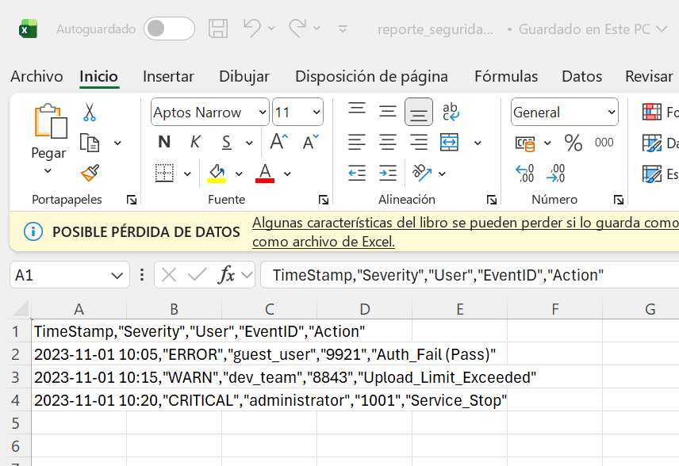
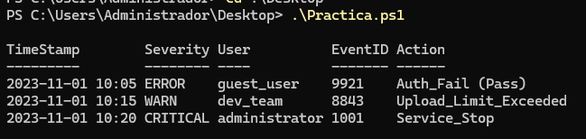

```
---------------- ADMINISTRACIÓN DE SISTEMAS INFORMÁTICOS Y REDES ----------------
---------------------------------------------------------------------------------

Módulo:                     ADMINISTRACIÓN DE SISTEMAS OPERATIVOS
Profesor:                   Víctor J. González
Unidad de Trabajo:          UT06
Práctica:                   PR0605. Limpieza de logs
Resultados de aprendizaje:  RA7
```


### 1.- Objetivo

Eres el administrador de sistemas de una empresa de seguridad. Un servidor legacy (antiguo) está generando unos logs de aplicación con un formato terrible y poco estándar. El departamento de seguridad necesita un informe limpio en CSV para poder auditar quién ha accedido al sistema.

No puedes cambiar cómo el servidor genera los logs. Tu única opción es crear un script en PowerShell que "digiera" ese texto crudo y lo transforme en información estructurada.

### 2.- Datos de entrada

Debes copiar y pegar este bloque de texto en su script dentro de una variable (Heredoc) o leerlo desde un archivo `.txt`.

```powershell
$logCrudo = @"
[INFO] ID:8842 :: 2023/11/01_10:00 :: User:admin_01 :: Action:Login_Success
[ERROR] ID:9921 :: 2023/11/01_10:05 :: User:guest_user :: Action:Auth_Fail (Pass)
[WARN] ID:8843 :: 2023-11-01 10:15 :: User:dev_team :: Action:Upload_Limit_Exceeded
[CRITICAL] ID:1001 :: 01-11-2023_10:20 :: User:ROOT :: Action:Service_Stop
"@
```

Observa bien los datos. Hay inconsistencias deliberadas:

- Las fechas tienen formatos distintos (`/`, `-`, `_`).
- Los delimitadores principales son `::`, pero hay espacios variables.
- Los usuarios a veces están en mayúsculas y otras en minúsculas.

### 3.- Los requisitos

Tu script debe procesar `$logCrudo` y cumplir **estrictamente** con los siguientes puntos. 

1.  **Normalización de fechas:** todas las fechas deben salir en formato estándar ISO `yyyy-MM-dd HH:mm`.
2.  **Limpieza de usuarios:**
      - Deben estar todos en **minúsculas**.
      - Si el usuario es "ROOT", debe ser renombrado automáticamente a "administrator" por política de seguridad.
3.  **Clasificación de gravedad:**
      - Debes extraer el nivel de log (INFO, ERROR, etc.) sin los corchetes `[]`.
4.  **Filtrado:**
      - Solo nos interesan las líneas que **NO** sean `[INFO]`. Ignora los logs informativos.
5.  **Salida estructurada:**
      - El script no debe escribir texto plano en la consola. Debe generar **Objetos PowerShell** (PSCustomObject) y finalmente exportarlos a un archivo `reporte_seguridad.csv`. Para crear esta tabla usa `[PSCustomObject]@{}`.

```bash
$logCrudo = @"
[INFO] ID:8842 :: 2023/11/01_10:00 :: User:admin_01 :: Action:Login_Success
[ERROR] ID:9921 :: 2023/11/01_10:05 :: User:guest_user :: Action:Auth_Fail (Pass)
[WARN] ID:8843 :: 2023-11-01 10:15 :: User:dev_team :: Action:Upload_Limit_Exceeded
[CRITICAL] ID:1001 :: 01-11-2023_10:20 :: User:ROOT :: Action:Service_Stop
"@


$lineas = $logCrudo -split "`n" | ForEach-Object { $_.Trim() }

$resultado = foreach ($linea in $lineas) {
    if ($linea -match "\[(?<Severity>.*?)\]\s*ID:(?<ID>\d+)\s*::\s*(?<Date>.*?)\s*::\s*User:(?<User>.*?)\s*::\s*Action:(?<Action>.*)") {
        
 
        $sev = $Matches['Severity'].Trim()


        if ($sev -eq "INFO") { continue }


        $userRaw = $Matches['User'].ToLower().Trim()
        $userFinal = if ($userRaw -eq "root") { "administrator" } else { $userRaw }

 
        $dateRaw = $Matches['Date'] -replace '_', ' '
        $timeStamp = [DateTime]::Parse($dateRaw).ToString("yyyy-MM-dd HH:mm")

        
        [PSCustomObject]@{
            TimeStamp = $timeStamp
            Severity  = $sev
            User      = $userFinal
            EventID   = $Matches['ID']
            Action    = $Matches['Action'].Trim()
        }
    }
}

$resultado | Export-Csv -Path "reporte_seguridad.csv" -NoTypeInformation -Encoding utf8
```
### 4.- Resultado esperado

Al abrir el CSV generado, debería verse algo así (el orden de columnas puede variar):

| TimeStamp        | Severity | User           | EventID | Action                  |
| :--------------- | :------- | :------------- | :------ | :---------------------- |
| 2023-11-01 10:05 | ERROR    | guest\_user    | 9921    | Auth\_Fail (Pass)       | 
| 2023-11-01 10:15 | WARN     | dev\_team      | 8843    | Upload\_Limit\_Exceeded |
| 2023-11-01 10:20 | CRITICAL | administrator  | 1001    | Service\_Stop           |




