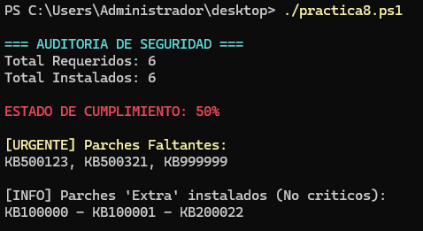

```
---------------- ADMINISTRACIÓN DE SISTEMAS INFORMÁTICOS Y REDES ----------------
---------------------------------------------------------------------------------

Módulo:                     ADMINISTRACIÓN DE SISTEMAS OPERATIVOS
Profesor:                   Víctor J. González
Unidad de Trabajo:          UT06
Práctica:                   PR0608. Comparación de listas
Resultados de aprendizaje:  RA7
```


### 1.- Objetivo

Eres administrador de sistemas Windows. Microsoft acaba de publicar un boletín de seguridad crítico debido a una vulnerabilidad "Zero-Day".

Tu jefe te ha pasado dos listas en formato texto:

1. **La lista oficial** de los parches (KBs) que *deberían* estar instalados para estar protegidos.
2. **La lista real** extraída de un servidor crítico (`SRV-PRODUCCION`) con los parches que tiene instalados actualmente.

Tu objetivo es crear un script que compare ambas listas y te diga exactamente **qué parches faltan** para poder instalarlos manualmente.

### 2. Datos de Entrada

Copia y pega estas dos variables al inicio de tu script. Son Arrays de strings simples.

```powershell
# Lista de parches CRÍTICOS requeridos por el boletín de seguridad
$kbsRequeridos = @("KB500123", "KB409999", "KB890830", "KB500556", "KB500321", "KB999999")

# Lista de parches INSTALADOS actualmente en el servidor 
# Nota: Están desordenados y podría haber parches viejos que no son críticos.
$kbsInstalados = @("KB100000", "KB500556", "KB409999", "KB100001", "KB890830", "KB200022")

```

### 3. Requerimientos Técnicos

El script debe realizar las siguientes operaciones utilizando lógica de arrays:

1. **Inicialización:** crea un array vacío llamado `$kbsFaltantes`.
2. **Lógica de comparación:**
   - Debes recorrer la lista de `$kbsRequeridos` uno a uno.
   - Para cada parche requerido, verifica si **NO** existe en la lista de `$kbsInstalados`.
   - Si el parche falta, añádelo al array `$kbsFaltantes`.

3. **Identificación de parches antiguos:**
   - Crea otro array vacío llamado `$kbsExtra`.
   - Identifica qué parches tiene el servidor instalados que **NO** estaban en la lista de requeridos (parches antiguos u otros no críticos).

4. **Informe de estado:**
   - El script debe calcular el porcentaje de cumplimiento (ej: si requiere 6 y tiene 3, cumple el 50%).
  - Debe imprimir la lista de los parches que faltan separados por comas.


### 4. Salida Esperada 

La consola debe mostrar algo muy similar a esto:

```text
=== AUDITORÍA DE SEGURIDAD ===
Total Requeridos: 6
Total Instalados: 6

ESTADO DE CUMPLIMIENTO: 50%

[URGENTE] Parches Faltantes:
KB500123, KB500321, KB999999

[INFO] Parches 'Extra' instalados (No críticos):
KB100000 - KB100001 - KB200022

```

```bash

# Lista de parches CRÍTICOS requeridos
$kbsRequeridos = @("KB500123", "KB409999", "KB890830", "KB500556", "KB500321", "KB999999")

# Lista de parches INSTALADOS actualmente en el servidor
$kbsInstalados = @("KB100000", "KB500556", "KB409999", "KB100001", "KB890830", "KB200022")


$kbsFaltantes = @()
$kbsExtra = @()

foreach ($kb in $kbsRequeridos) {
    if ($kb -notin $kbsInstalados) {
        $kbsFaltantes += $kb
    }
}

foreach ($kb in $kbsInstalados) {
    if ($kb -notin $kbsRequeridos) {
        $kbsExtra += $kb
    }
}

$totalReq = $kbsRequeridos.Count
$totalInstalados = $kbsInstalados.Count
$cantidadFaltantes = $kbsFaltantes.Count
$cantidadCumplidos = $totalReq - $cantidadFaltantes

$porcentajeCumplimiento = ($cantidadCumplidos / $totalReq) * 100

Write-Host "`n=== AUDITORIA DE SEGURIDAD ===" -ForegroundColor Cyan
Write-Host "Total Requeridos: $totalReq"
Write-Host "Total Instalados: $totalInstalados"
Write-Host ""

$colorProgreso = if ($porcentajeCumplimiento -eq 100) { "Green" } else { "Red" }
Write-Host "ESTADO DE CUMPLIMIENTO: $porcentajeCumplimiento%" -ForegroundColor $colorProgreso
Write-Host ""

Write-Host "[URGENTE] Parches Faltantes:" -ForegroundColor Yellow
if ($kbsFaltantes.Count -gt 0) {
    Write-Host ($kbsFaltantes -join ", ")
} else {
    Write-Host "Ninguno. El sistema esta al dia." -ForegroundColor Green
}

Write-Host ""
Write-Host "[INFO] Parches 'Extra' instalados (No criticos):"
if ($kbsExtra.Count -gt 0) {
    Write-Host ($kbsExtra -join " - ")
} else {
    Write-Host "No hay parches adicionales."
}
Write-Host ""

```

