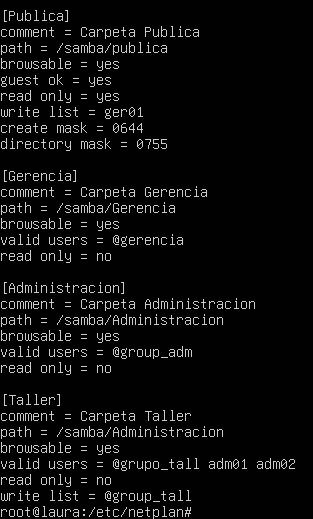
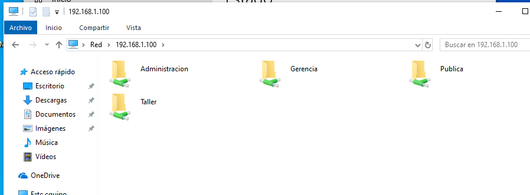
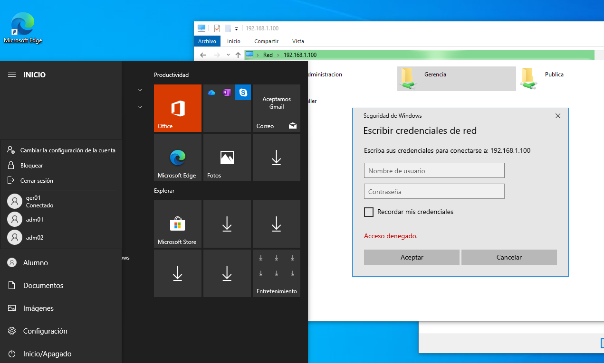
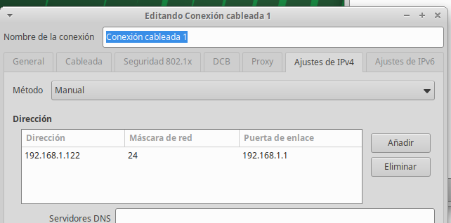
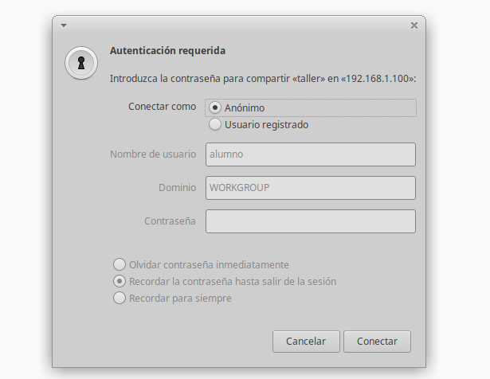
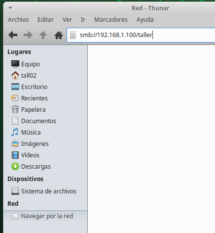

```
---------------- ADMINISTRACIÓN DE SISTEMAS INFORMÁTICOS Y REDES ----------------
---------------------------------------------------------------------------------

Módulo:                     ADMINISTRACIÓN DE SISTEMAS OPERATIVOS
Profesor:                   Víctor J. González
Unidad de Trabajo:          UT07
Práctica:                   PR0701. Compartición de carpetas con Samba
Resultados de aprendizaje:  RA6
```

# PR0701:  Compartición de carpetas con Samba

En esta práctica vamos a trabajar con carpetas compartidas en Linux mediante Samba preparando una infraestructura de red para una empresa:

Vamos a suponer que queremos compartir 4 carpetas:

- Gerencia
- Administración
- Taller
- Pública

Por otro lado, la empresa tendrá 6 empleados: `ger01`, `adm01`, `adm02`, `tall01`, `tall02` y `tall03`.

Estas carpetas serán accesibles por los siguientes usuarios según los siguientes criterios:

En el Xubuntu Server, actualizamos e instalamos samba
```bash
sudo apt update
sudo apt install samba
```
Y creamos las carpetas
```bash
mkdir /samba_compartidos
cd /samba_compartidos
mkdir Gerencia
mkdir Administracion
mkdir Taller
mkdir Publica
```
- Todos los empleados podrán acceder a la carpeta `Pública` con permisos de lectura, mientras que el empleado `ger01` podrá hacerlo con permisos de lectura y escritura.
-El empleado `ger01` podrá acceder con todos los permisos a la carpeta `Gerencia`.
-Los empleados `adm01` y `adm02` tendrán acceso con todos los permisos a `Administración` y con permisos de lectura únicamente a la carpeta `Taller`.
- Por último, los usuarios `tall01`, `tall02` y `tall03` tendrán acceso de lectura y escritura a la carpeta `Taller`.
- Finalmente, cualquier usuario que no sea uno de los anteriores (invitado) podrá acceder únicamente a la carpeta `Pública`.

Algunas cuestiones que tienes que tener en cuenta:

- Utiliza grupos para agrupar usuarios.
- Crea una carpeta común dentro de la cual estarán todas las carpetas compartidas.
- Recuerda que el propietario de las carpetas compartidas es `root` y el grupo propietario aquel que vaya a tener permisos.
- Para asignar diferentes tipos de permisos a diferentes usuarios en la misma carpeta debes usar los parámetros `read list` y `write list` del fichero smb.conf. 

Creamos los usuarios y los grupos y los añadimos
```bash
addgroup grupo_adm
addgroup grupo_tall
```
```bash
adduser ger01
adduser adm01
adduser adm02
adduser tall01
adduser tall02
adduser tall03
```
```bash
usermod -aG group_adm adm01
usermod -aG group_adm adm02
usermod -aG group_tall tall01
usermod -aG group_tall tall02
usermod -aG group_tall tall03
```
Añadimos los usuarios a la base de datos de Samba
```bash
smbpasswd -a ger01
smbpasswd -a adm01
smbpasswd -a adm02
smbpasswd -a tall01
smbpasswd -a tall02
smbpasswd -a tall03
```


La contraseña de los usuarios en samba es laura.

Añadimos lo siguiente en el fichero /etc/samba/smb.conf y en global añadimos la linea **map to guest = bad user**



Reiniciaremos samba con **systemctl restart smbd**
```bash
sudo chown ger01:root /samba_compartidos/Gerencia
sudo chmod 700 /samba_compartidos/Gerencia

sudo chown root:grupo_adm /samba_compartidos/Administracion
sudo chmod 770 /samba_compartidos/Administracion

sudo chown root:grupo_tall /samba_compartidos/Taller
sudo chmod 775 /samba_compartidos/Taller

sudo chmod 777 /samba_compartidos/Publica
```

Los usuarios `ger01`, `adm01` y `adm02` utilizarán máquinas Windows, por lo que créalos en un Windows de escritorio que tengas y verifica que funcionan.

En el explorador de archivos nos colocamos en Red y colocamos la ip del ubuntu server **\\192.168.1.100**



Comporbamos que el usuario por defecto alumno no pueda acceder a otra  carpeta que no sea publica



Comprabos con el usuario adm02 podamos entrar a administracion y añadir un archivo


El resto de los usuarios usan Linux, por lo que debes crearlos en otra máquina Linux y prueba el acceso desde ella.

Configuramos la red para que se pueda conectar



Comprobamos que al usuario invitado no le deje entrar a taller



Para entrar a la carpeta usarenos la ruta

```bash
smb://192.168.1.100/taller
```



Para la entrega de la práctica debes documentar todos los pasos realizados.